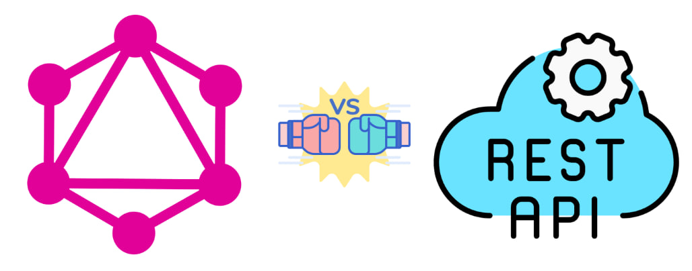
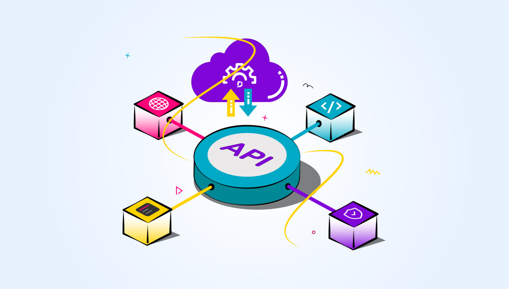
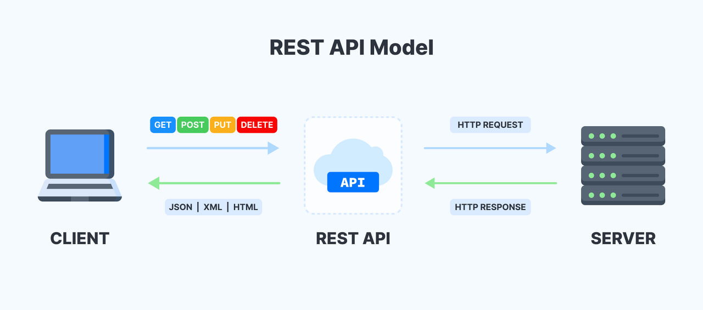
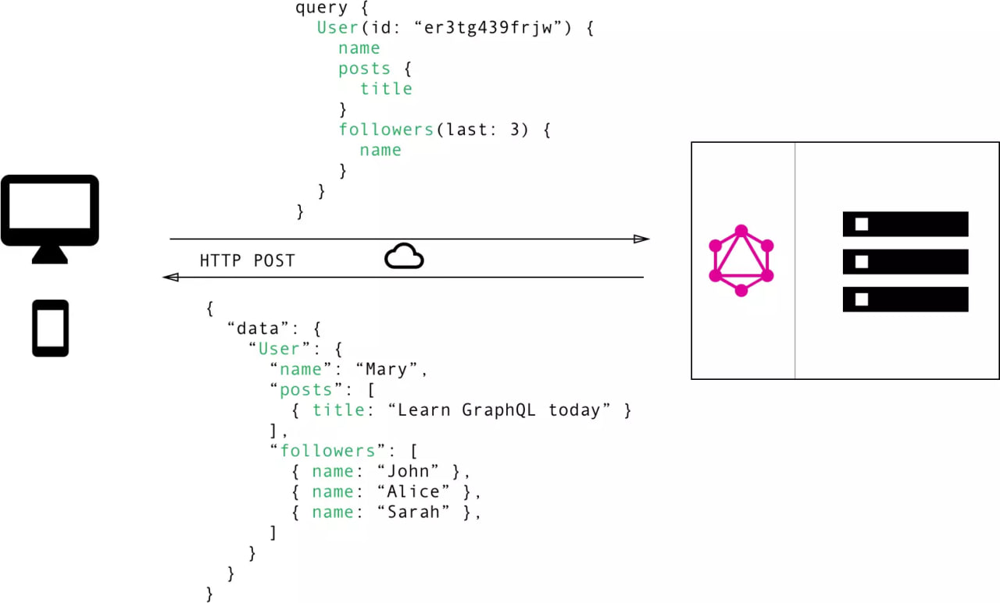
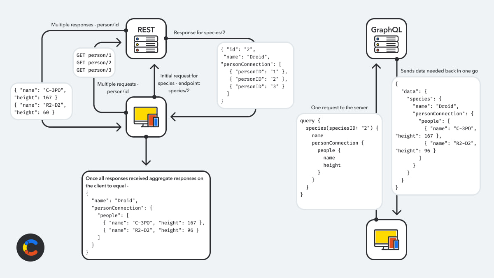

# REST API vs GraphQL: Порівняння підходів до розробки веб-сервісів



## Вступ

У сучасному світі веб-розробки, де швидкий і ефективний доступ до даних є критично важливим, розробники постійно шукають оптимальні підходи. 

REST API на основі HTTP був стандартом протягом багатьох років. Проте GraphQL, сучасна альтернатива, дозволяє запитувати лише необхідні дані, уникаючи зайвої інформації. Розуміння відмінностей між цими підходами допомагає приймати оптимальні рішення, що підвищують продуктивність, ефективно використовують ресурси та покращують досвід користувачів.

### Що таке API?

Для розуміння відмінностей між REST API та GraphQL почнемо з основ.



**API** - це інтерфейс прикладного програмування, набір правил для спілкування програмних систем. У веб-розробці веб-API є шлюзом між клієнтами та ресурсами на сервері.

Далі ми детально порівняємо REST API та GraphQL, висвітлимо їх переваги та недоліки, та надамо рекомендації для вибору залежно від потреб проекту.

## Основи REST API та GraphQL

### Що таке REST API?

#### Визначення REST API, його основні принципи та архітектурні стилі.

**Representational State Transfer (REST)** — це архітектурний підхід до розробки програмного забезпечення, який визначає правила для створення API. 

Спочатку REST був створений як керівництво для організації взаємодії в складних мережах, таких як Інтернет. Ця архітектура дозволяє підтримувати високопродуктивний і надійний зв'язок навіть у масштабованих системах. REST забезпечує легкість впровадження та модифікації, а також надає API видимість і кросплатформну сумісність.

Розробники API можуть обирати різні архітектурні підходи. Якщо API відповідає принципам REST, його називають REST API. Веб-служби, які реалізують REST, отримують назву RESTful веб-служб. Термін "RESTful API" зазвичай використовується для позначення веб-API, які базуються на REST. Водночас терміни "REST API" та "RESTful API" часто використовуються як синоніми.

#### Основні принципи 

REST API будується на кількох ключових принципах, які роблять його ефективним і гнучким інструментом для обміну даними.

- **Stateless:** Кожен запит обробляється незалежно, сервер не пам'ятає попередні.
- **Client-Server:** Клієнт і сервер незалежні, можуть розвиватися окремо.
- **Uniform Interface:** Стандартизована взаємодія через ресурси, HTTP-методи, представлення та посилання.
- **Cacheable:** Клієнт може зберігати дані для швидшого доступу.
- **Layered System:** Сервери організовані в шари для гнучкості та масштабованості.
- **Code on Demand:** (Необов'язково) Сервер може надсилати код для виконання клієнтом.

Загалом, принципи rest api забезпечують ефективну та гнучку взаємодію між клієнтом і сервером, а також стандартизацію, надійність і стійкість системи.

#### Як працюють RESTful API?



Основна функція RESTful API схожа на перегляд веб-сторінок: клієнт звертається до сервера через API, коли йому потрібен доступ до ресурсу. 

Оскільки REST API використовує кілька кінцевих точок (endpoints), клієнту може знадобитися виконати кілька запитів для отримання всіх необхідних даних. Це явище називається under-fetching.  

Ось основні кроки виклику REST API:  
1. **Запит клієнта.** Клієнт надсилає запит на сервер, дотримуючись документації API, щоб правильно відформатувати запит.  
2. **Автентифікація та перевірка.** Сервер перевіряє автентичність клієнта та підтверджує його права на виконання запиту.  
3. **Обробка запиту.** Сервер приймає запит і виконує необхідні операції.  
4. **Відповідь сервера.** Сервер надсилає клієнту відповідь, яка містить інформацію про успішність запиту та запитані дані (за наявності).  

Деталі запитів і відповідей REST API можуть відрізнятися залежно від реалізації та дизайну API.

#### Що містить клієнтський запит RESTful API?

Запит RESTful API зазвичай містить такі ключові компоненти:

- **Унікальний ідентифікатор ресурсу (URL):** Визначає конкретний ресурс, до якого звертається клієнт. URL (Uniform Resource Locator) – це адреса ресурсу в інтернеті, аналогічна веб-адресі.
- **Метод HTTP:** Вказує на дію, яку потрібно виконати з ресурсом. Найпоширеніші методи:
  - GET: Отримання інформації про ресурс. Запити GET можуть бути кешовані та дозволяють передавати параметри для фільтрації даних.
  - POST: Створення нового ресурсу на сервері. Повторні POST-запити можуть призвести до створення кількох однакових ресурсів.
  - PUT: Оновлення існуючого ресурсу на сервері. Повторні PUT-запити матимуть однаковий результат.
  - DELETE: Видалення ресурсу з сервера. Вимагає відповідної автентифікації.
- **HTTP заголовки:** Містять метадані про запит, такі як формат даних, інформація про автентифікацію тощо.
- **Дані (тіло запиту):** Інформація, яку клієнт надсилає на сервер при використанні методів POST, PUT тощо.
- **Параметри:** Додаткові відомості, що передаються серверу для уточнення запиту. Існують різні типи параметрів:
  - Параметри шляху: Входять до складу URL-адреси.
  - Параметри запиту: Додаються до URL після знаку питання (?).
  - Параметри файлів cookie: Використовуються для швидкої автентифікації клієнта.

#### Що містить відповідь сервера RESTful API?

Відповідь сервера RESTful API зазвичай містить такі компоненти:

- **Рядок стану (Status Code):** Тризначний код, що інформує про результат виконання запиту. Це важливий елемент для розуміння успішності операції на стороні клієнта. Найпоширеніші коди включають:
    - 2XX (Успіх):
      - 200 OK: Запит виконано успішно.
      - 201 Created: Новий ресурс успішно створено (зазвичай після POST-запиту).
    - 4XX (Помилка клієнта):
      - 400 Bad Request: Неправильний запит, який сервер не може обробити.
      - 404 Not Found: Запитаний ресурс не знайдено.
    - 3XX (Перенаправлення): Вказує на необхідність перенаправлення запиту на іншу URL-адресу.
- **Тіло повідомлення (Response Body):** Містить представлення запитуваного ресурсу. Формат представлення (наприклад, JSON, XML) визначається в заголовках запиту. Наприклад, для запиту даних про користувача "Іван" віком 30 років, відповідь у форматі JSON може виглядати так: 
```JSON
{
  "name":"Іван", 
  "age":30
}
```
- **Заголовки відповіді:** Містять метадані про відповідь, такі як тип вмісту, дата, інформація про сервер тощо.

Отже, REST API базується на концепції ресурсів, до яких клієнти звертаються за допомогою HTTP-методів, отримуючи відповіді у стандартизованому форматі.

#### Приклади використання REST API.

- **Отримання списку користувачів (GET)**: Цей запит ілюструє використання методу GET для отримання колекції ресурсів.

Приклад запиту:
```http request
GET /api/users
```   
Приклад відповіді сервера (JSON):
```JSON
[
  { 
    "id": 1, 
    "name": "Іван Петренко", 
    "email": "ivan.petrenko@example.com"
  },
  { 
    "id": 2, 
    "name": "Марія Сидоренко", 
    "email": "maria.sydorenko@example.com"
  }
]
```

- **Створення нового користувача (POST):** Тут показано використання методу POST для створення нового ресурсу, причому дані про користувача передаються в тілі запиту у форматі JSON.

Приклад запиту:
```http request
POST /api/users
```
```
{
    "name": "Олена Коваль",
    "email": "olena.koval@example.com"
}
```
Приклад відповіді сервера (успішне створення, код 201 Created):
```JSON
{ 
    "id": 3, 
    "name": "Олена Коваль", 
    "email": "olena.koval@example.com" 
}
```   
- **Оновлення інформації про користувача (PUT):** Цей приклад демонструє використання методу PUT для оновлення існуючого ресурсу.

Приклад запиту:
```http request
PUT /api/users/1
```
```
{
    "name": "Іван Петренко-Оновлений",
    "email": "ivan.petrenko.updated@example.com"
}
```  
Приклад відповіді сервера (успішне оновлення):
```JSON
{ 
  "id": 1, 
  "name": "Іван Петренко-Оновлений", 
  "email": "ivan.petrenko.updated@example.com"
}
```
- **Видалення користувача (DELETE):** Тут показано використання методу DELETE для видалення ресурсу.

Приклад запиту:
```http request
DELETE /api/users/1 
```

Приклад відповіді сервера (успішне видалення, сервер може не повертати контент): 
```
204 No Content
```

### Що таке GraphQL?

#### Визначення GraphQL, основні концепції та принципи роботи.

**GraphQL** – це мова запитів для вашого API та середовище виконання цих запитів для наявних даних. На відміну від REST API, де сервер визначає структуру відповідей, GraphQL дозволяє клієнтам запитувати лише ті дані, які їм потрібні, і отримувати їх у єдиному запиті. Розроблена компанією Facebook і вперше представлена у 2012 році, а публічно випущена у 2015 році, GraphQL є відкритим вихідним кодом і підтримується GraphQL Foundation.

Цей засіб взаємодії дає змогу клієнту точно вказати, які дані йому потрібні від сервера. Це на відміну від традиційних API, які надають заздалегідь визначені набори даних. 

#### Основні принципи GraphQL  

- **Ієрархічність:** Запити відображають ієрархію даних, дозволяючи отримувати пов'язані дані в одному запиті.  
- **Орієнтованість на клієнта:** Клієнт визначає, які дані потрібні, уникаючи надлишкового (over-fetching) або недостатнього отримання (under-fetching).  
- **Сильна типізація:** GraphQL використовує схему для опису типів даних, що забезпечує валідацію запитів і надає чітку документацію.  
- **Інтроспекція:** Клієнти можуть запитувати схему API, що спрощує дослідження API через інструменти, як-от GraphiQL.  
- **Один endpoint:** GraphQL API зазвичай має одну кінцеву точку на відміну від REST API з багатьма endpoint-ами.  

#### Кроки виконання запиту:  



1. **Формування запиту:** Клієнт створює документ із операцією (запит, мутація, підписка).  
2. **Надсилання запиту:** Документ передається на сервер через HTTP POST.  
3. **Валідація:** Сервер перевіряє, чи відповідає запит схемі API.  
4. **Виконання:** Сервер використовує "розв'язувачі" для отримання потрібних даних.  
5. **Відповідь:** Сервер надсилає JSON-результат або повідомлення про помилки.  

#### Що містить клієнтський запит GraphQL?  

- **Тип операції:**  
  - `query`: отримання даних.  
  - `mutation`: зміна даних.  
  - `subscription`: реальні оновлення.  
- **Набір вибірки:** Поля, які потрібно отримати.  
- **Аргументи:** Фільтри чи параметри для полів.  
- **Псевдоніми:** Перейменування полів у відповіді.  
- **Фрагменти:** Перевикористовувані набори полів.  
- **Директиви:** Зміна виконання запиту за умов (наприклад, @include, @skip).

Приклад:

```graphql
query GetUserAndPosts {
  user(id: 123) {
    id
    name
    email
    posts {
      title
      content
    }
  }
}
```

`query GetUserAndPosts` – це назва операції.

`user(id: 123)` – запитує користувача з ідентифікатором 123.

`{ id, name, email, posts { title, content } }` – визначає поля, які потрібно отримати для користувача та його постів.

#### Що містить відповідь сервера GraphQL?

Відповідь сервера GraphQL зазвичай містить такі компоненти:

- **data:** Об'єкт JSON, що містить запитувані дані. Структура цього об'єкта точно відповідає структурі запиту.
- **errors (необов'язково):** Масив об'єктів, що описують помилки, які виникли під час виконання запиту. Кожен об'єкт помилки може містити повідомлення про помилку, місцезнаходження помилки в запиті та додаткову інформацію.
- **extensions (необов'язково):** Об'єкт для додавання додаткової інформації, не передбаченої специфікацією GraphQL (наприклад, інформація про налагодження).

Приклад відповіді сервера GraphQL (на запит вище):
```JSON
{
  "data": {
    "user": {
      "id": "123",
      "name": "Іван Петренко",
      "email": "ivan.petrenko@example.com",
      "posts": [
        {
          "title": "Мій перший пост",
          "content": "Текст першого посту"
        },
        {
          "title": "Другий запис у блозі",
          "content": "Текст другого посту"
        }
      ]
    }
  }
}
```

#### Приклади використання GraphQL

Отримання даних про користувача та його пости **(Query)**:

```graphql
query GetUserPosts {
  user(id: "456") {
    id
    name
    email
    posts {
      id
      title
    }
  }
}
```

Приклад відповіді сервера:

```JSON
{
  "data": {
    "user": {
      "id": "456",
      "name": "Марія Сидоренко",
      "email": "maria.sydorenko@example.com",
      "posts": [
        {
          "id": "101",
          "title": "Подорож до Італії"
        },
        {
          "id": "102",
          "title": "Рецепт смачного пирога"
        }
      ]
    }
  }
}
```

Створення нового користувача **(Mutation)**:

```graphql
mutation CreateUser {
  createUser(input: {
    name: "Олена Коваль",
    email: "olena.koval@example.com"
  }) {
    id
    name
    email
  }
}
```

Приклад відповіді сервера:

```JSON
{
  "data": {
    "createUser": {
      "id": "789",
      "name": "Олена Коваль",
      "email": "olena.koval@example.com"
    }
  }
}
```

Отримання оновлень про нові повідомлення в реальному часі **(Subscription)**:

```graphql
subscription NewPostCreated {
  newPost {
    id
    title
    content
  }
}
```

Сервер встановлює постійне з'єднання з клієнтом і надсилає оновлення щоразу, коли створюється новий пост.

## Порівняння REST API та GraphQL



Тепер перейдемо безпосередньо до порівняння. Основна архітектурна відмінність полягає в тому, що REST API орієнтований на ресурси, а GraphQL – на дані. REST API використовує фіксовані ендпоінти, тоді як GraphQL дозволяє клієнту гнучко формувати запити.

### Продуктивність

З точки зору продуктивності, GraphQL потенційно може бути більш ефективним, оскільки клієнт отримує лише необхідні дані, уникаючи проблеми надмірного отримання (over-fetching) даних, характерної для REST API. Однак, складні запити GraphQL можуть створювати навантаження на сервер.

### Гнучкість та можливості

GraphQL безперечно виграє в плані гнучкості, дозволяючи клієнту запитувати саме ті дані, які йому потрібні, та в потрібній структурі. REST API більш обмежений заздалегідь визначеними ендпоінтами.

### Безпека

Обидва підходи мають свої аспекти безпеки. Для REST API важливо забезпечити захист ендпоінтів. У GraphQL потрібно ретельно продумувати схему та права доступу до різних типів даних.

### Еволюційність

GraphQL часто вважається більш еволюційним, оскільки додавання нових полів не впливає на існуючі запити клієнтів. REST API часто потребує версіонування для внесення змін, щоб не порушити роботу існуючих клієнтів.

## Практичні приклади

### Реальні кейси використання REST API:

REST API залишається стандартом де-факто для багатьох веб-сервісів. Його широко використовують для розробки простих CRUD-операцій, публічних API, де важлива простота та легкість інтеграції, а також у випадках, коли структура даних відносно проста та передбачувана. Приклади включають API для блогів, прості інтернет-магазини, системи управління контентом тощо. Конкретні приклади з існуючих проектів та їх результати можна знайти в документації численних публічних API (наприклад, Twitter API v1.1, Stripe API).

### Реальні кейси використання GraphQL:

GraphQL демонструє свою ефективність у сценаріях, де потрібна гнучкість та оптимізація отримання даних:

- **Веб-розробка:** GraphQL ідеально підходить для сучасних веб-додатків, особливо Single Page Applications (SPA), де різні компоненти інтерфейсу потребують різних наборів даних. Його структура спрощує роботу з динамічними інтерфейсами та адаптивними веб-додатками, дозволяючи отримувати необхідні дані одним запитом.

- **Мобільна розробка:** Здатність GraphQL отримувати лише необхідні дані є критично важливою для мобільних додатків з обмеженою пропускною здатністю та зарядом батареї.

- **Соціальні мережі та новинні портали:** У проєктах, де динамічне відображення контенту має ключове значення, GraphQL дає змогу клієнтам запитувати тільки ті частини даних, які відображаються на екрані (наприклад, текст посту, кількість лайків, останні коментарі). Можливість отримання пов’язаних даних в одному запиті спрощує побудову новинних стрічок і відображення розгалужених коментарів.

Багато великих компаній і популярних продуктів вибирають GraphQL для ефективної роботи з даними та забезпечення гнучкості в обміні інформацією між клієнтом і сервером. Перш за все, варто згадати Facebook, який створив GraphQL для своєї соціальної мережі. Це дало їм змогу ефективно керувати великим обсягом даних і надавати різним клієнтським додаткам (веб, мобільні) саме ті дані, які їм потрібні. Крім Facebook, інші великі компанії та продукти, як-от Airbnb, GitHub, Pinterest, Shopify, New York Times, також використовують GraphQL для різноманітних завдань, від створення динамічних інтерфейсів користувачів до управління великими обсягами даних і надання гнучких API.

## Висновки

### Підсумок порівняння

GraphQL і REST API – це два популярні підходи до розробки API, кожен зі своїми перевагами та недоліками. GraphQL – це потужна мова запитів і середовище виконання, яке дозволяє клієнту точно вказати, які дані йому потрібні від сервера, забезпечуючи гнучкість та ефективність. REST API – це перевірений часом архітектурний стиль для створення API, який добре підходить для простих додатків з CRUD-операціями, де не потрібна висока гнучкість або оптимізація передачі даних.

Як підсумок, можна сказати, що GraphQL надає гнучкіший і потенційно ефективніший підхід до передавання даних, особливо для складних клієнтських додатків, але вимагає більше зусиль під час впровадження та підтримки, а також розуміння концепцій схем та розв'язувачів. REST API, хоча менш гнучкий для клієнта, простіший у розумінні, впровадженні та підтримці, і залишається чудовим вибором для багатьох сценаріїв. Вибір між ними залежить від конкретних потреб проєкту та рівня складності, готовності до змін у структурі сервера, а також від рівня досвіду та навичок команди розробки.

### Рекомендації

Отже, що ж обрати? Вибір залежить від специфіки вашого проекту.

#### Обирайте REST API, якщо:

- Вам потрібен простий API для базових CRUD-операцій.
- Ви цінуєте простоту впровадження, розуміння та підтримки.
- Ваш додаток має відносно прості вимоги до даних.
- Ваша команда має більший досвід роботи з REST.
#### Обирайте GraphQL, якщо:

- Ваш додаток має складні вимоги до даних і залежності між ними.
- Вам потрібна гнучкість запитів та оптимізація продуктивності, особливо на клієнтській стороні (мобільні додатки, SPA).
- Ви хочете уникнути over-fetching та under-fetching.
- Ви плануєте активно розвивати API і хочете мінімізувати вплив змін на клієнтів.
- Ваша команда готова вивчити нові концепції та інструменти.

## Використані джерела
1. <a name="link_1" href="https://aws.amazon.com/what-is/restful-api/?nc1=h_ls">What is a RESTful API?</a>
2. <a name="link_1" href="https://foxminded.ua/shcho-take-rest-api/">REST API як спосіб спілкування компонент веб-додатків</a>
3. <a name="link_1" href="https://aws.amazon.com/graphql/?trk=faq_card">What is GraphQL?</a>
4. <a name="link_1" href="https://foxminded.ua/graphql-shcho-tse/">Що таке GraphQL і як з ним працювати?</a>
5. <a name="link_1" href="https://www.contentful.com/blog/graphql-vs-rest-exploring-how-they-work/">GraphQL vs. REST: Exploring how they work</a>
